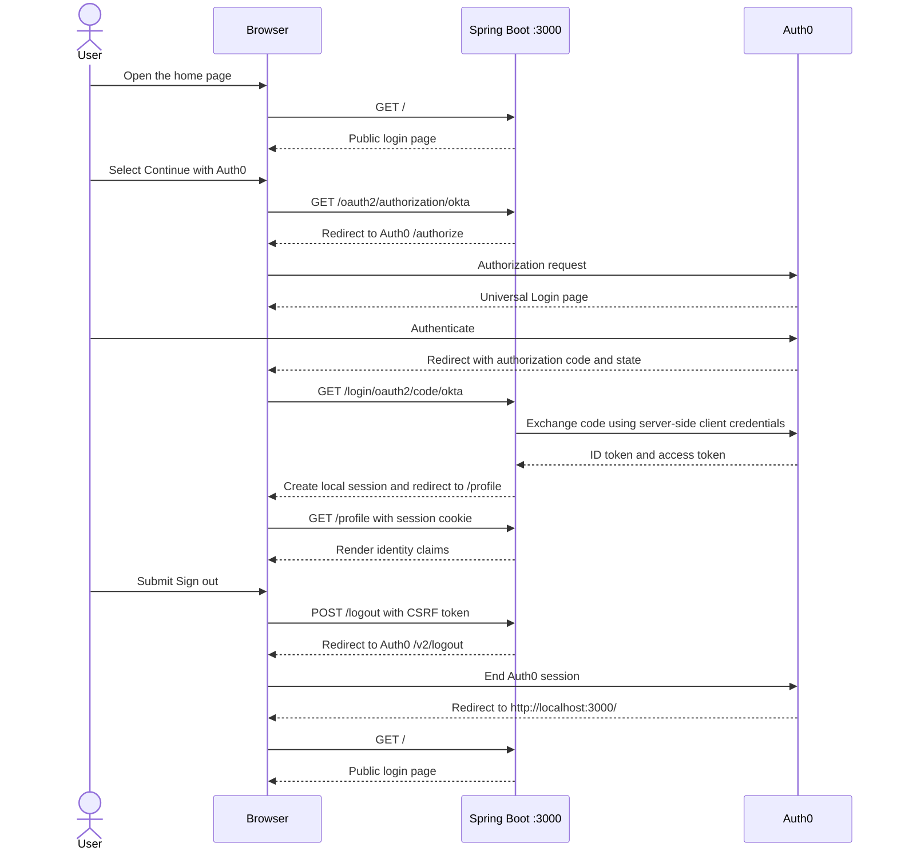

# Auth0 Spring Boot Web Application

This Spring Boot application uses Auth0 for OpenID Connect authentication. The home page is public, the profile page requires authentication, and logout clears both the local Spring Security session and the Auth0 session.

The application runs on `http://localhost:3000`.

## Changes required to make the original application work

The original Spring Boot scaffold supplied the Gradle wrapper, application entry point, base configuration, and test setup. The following changes complete the Auth0 integration:

1. Added Spring Security, Spring Web, Thymeleaf, Thymeleaf Spring Security support, and the Okta Spring Boot starter to `build.gradle`.
2. Spring Boot `3.5.12` and the Okta starter `3.0.8`.
3. Kept Java 17 as the toolchain required by Spring Boot 3 and the Okta starter.
4. Added `application.yml` with port `3000`, the Auth0 issuer, client ID, and client secret under `okta.oauth2`.
5. Added a Spring Security filter chain that keeps `/` and `/css/**` public and requires authentication for every other route.
6. Enabled OAuth 2.0 login and forced successful authentication to continue to `/profile`.
7. Added the `/` controller route, including a redirect to `/profile` when a local authenticated session already exists.
8. Added the protected `/profile` route and exposed the authenticated OIDC claims to the Thymeleaf view.
9. Added an Auth0 logout handler that redirects to the tenant `/v2/logout` endpoint with the client ID and local return URL.
10. Added the public login page, authenticated profile page, claim rendering, logout form, and responsive styling.
11. Added `src/main/resources/application.yml` to `.gitignore` so runtime credentials stay on the local filesystem without being committed.

## Credential file

`src/main/resources/application.yml` must remain on the local filesystem because Spring Boot reads it when the application starts. It must remain ignored and untracked because it contains the Auth0 client secret.

Use this structure without committing the populated file:

```yaml
server:
  port: 3000

okta:
  oauth2:
    issuer: https://YOUR_AUTH0_DOMAIN/
    client-id: YOUR_AUTH0_CLIENT_ID
    client-secret: YOUR_ROTATED_AUTH0_CLIENT_SECRET
```

The issuer must include `https://` and end with `/`.

Verify the local file protection:

```bash
test -f src/main/resources/application.yml
git check-ignore -v src/main/resources/application.yml
git status --ignored --short src/main/resources/application.yml
```

The final command must show `!! src/main/resources/application.yml`.

If a client secret was ever committed or pushed, removing the file from Git history is not enough. Rotate the secret in Auth0 and place only the new value in the ignored local file.

## Authentication sequence



The browser receives the authorization code, but the application performs the token exchange on the server. The client secret is never sent to the browser. Spring Security stores the authenticated state in the local HTTP session.

## Auth0 setup

1. Sign in to the [Auth0 Dashboard](https://manage.auth0.com/).
2. Open **Applications**, then **Applications**.
3. Create an application and select **Regular Web Applications**.
4. Open the application settings.
5. Set **Allowed Callback URLs** to:

   ```text
   http://localhost:3000/login/oauth2/code/okta
   ```

6. Set **Allowed Logout URLs** to:

   ```text
   http://localhost:3000/
   ```

7. Save the Auth0 application settings.
8. If the previous secret reached Git, rotate it from the application settings before continuing.
9. Copy the Auth0 domain, client ID, and rotated client secret into the existing ignored `src/main/resources/application.yml`.
10. Keep the trailing `/` on the issuer URL.

The callback and logout URLs must match exactly, including the port, path, and trailing slash.

## Run the application

### 1. Verify Java

```bash
java -version
```

Java 17 or newer is required.

### 2. Verify the credential file

```bash
test -f src/main/resources/application.yml
git check-ignore -q src/main/resources/application.yml
```

Both commands must finish successfully.

### 3. Run the tests

```bash
./gradlew clean test
```

### 4. Start Spring Boot

```bash
./gradlew bootRun
```

Keep this terminal running. Spring Boot starts on port `3000` and loads the Auth0 OIDC discovery document from the configured issuer.

### 5. Start login

On macOS:

```bash
open http://localhost:3000
```

On Linux:

```bash
xdg-open http://localhost:3000
```

To enter the Auth0 flow directly:

```bash
open http://localhost:3000/oauth2/authorization/okta
```

Authenticate on the Auth0 Universal Login page. Auth0 returns the browser to `/login/oauth2/code/okta`, Spring Security establishes the local session, and the application redirects to `/profile`.

### 6. Verify the authenticated session

Open:

```text
http://localhost:3000/profile
```

The page displays the email, profile image when available, and all OIDC claims returned for the user.

### 7. Log out

Use the **Sign out** button on the profile page. Logout is a protected `POST` request, so a browser command that opens `/logout` with `GET` is not equivalent. The form supplies the Spring Security CSRF token and then sends the browser through the Auth0 logout endpoint.

### 8. Stop the application

Press `Ctrl+C` in the terminal running `bootRun`.

## Benefits

- Authentication, password policy, social or enterprise connections, and multifactor authentication can be centralized in Auth0.
- OpenID Connect Authorization Code Flow keeps token exchange and the client secret on the server.
- Spring Security provides session handling, CSRF protection, callback processing, and OIDC principal creation.
- The application contains little identity protocol code because discovery and token validation are handled by maintained libraries.
- Authenticated OIDC claims are directly available to controllers and Thymeleaf views.
- Auth0 Universal Login can change without rebuilding the application UI.

## Tradeoffs

- Login and application startup depend on Auth0 availability, tenant configuration, DNS, and outbound network access.
- The client secret requires secure storage, rotation, and separate handling for every environment.
- The Okta starter uses the registration name `okta` even when the identity provider is Auth0, which makes the login and callback URLs less intuitive.
- Authentication does not provide application authorization by itself. Roles and permissions require an additional design.
- The current session is stored in the application process. Multiple instances require shared session storage or another session strategy.
- Logout behavior depends on both the local Spring Security session and the Auth0 logout allowlist being configured correctly.
- A local YAML credential file is suitable for local development but should be replaced by a managed secret source in deployed environments.

## Troubleshooting

### Callback URL mismatch

Confirm that Auth0 contains exactly:

```text
http://localhost:3000/login/oauth2/code/okta
```

### Issuer or discovery failure

Confirm the issuer uses the Auth0 tenant domain, starts with `https://`, ends with `/`, and is reachable from the machine running Spring Boot.

### Invalid client credentials

Confirm the client ID and current rotated client secret belong to the same Auth0 application. Restart Spring Boot after editing `application.yml`.

### Logout returns an allowlist error

Confirm that **Allowed Logout URLs** contains exactly:

```text
http://localhost:3000/
```

### Port 3000 is already in use

On macOS or Linux, identify the process:

```bash
lsof -i :3000
```

Stop the conflicting process or update the local port, callback URL, and logout URL together.

## References

- [Auth0 Spring Boot quickstart](https://auth0.com/docs/quickstart/webapp/java-spring-boot)
- [Auth0 client-secret rotation](https://auth0.com/docs/get-started/applications/rotate-client-secret)
- [Okta Spring Boot starter](https://github.com/okta/okta-spring-boot)
