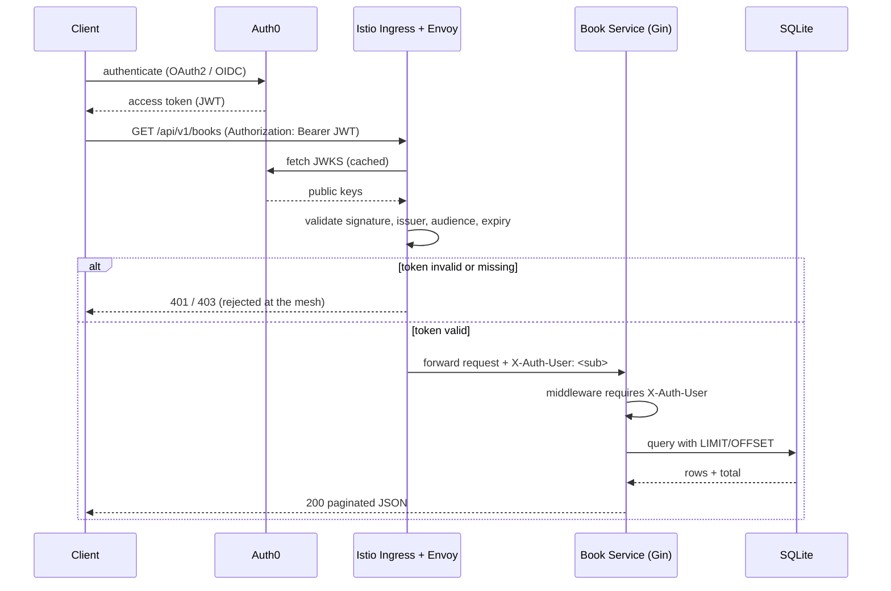
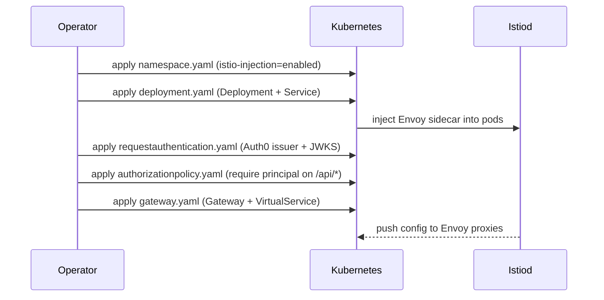

# Book Service — Go + Gin + SQLite, JWT via Istio & Auth0

A modular REST book service written in Go with Gin and SQLite. Authentication is
handled at the service mesh: **Istio validates the Auth0 JWT** (signature, issuer,
audience, expiry) against Auth0's JWKS and forwards the caller identity to the
service as a header. The application stays library-light and does no JWT crypto
itself — it trusts the mesh, which is the idiomatic Istio pattern.

## Architecture


The mesh is the security boundary. `RequestAuthentication` pins the Auth0 issuer
and JWKS URI; `AuthorizationPolicy` requires a valid principal on `/api/*` and
leaves `/health` open. Istio maps the JWT `sub` claim into the `X-Auth-User`
header. The Go service requires that header and rejects requests without it.

## Layout

```
cmd/server            entrypoint, wiring
internal/config       env-driven configuration
internal/db           sqlite connection + migration
internal/models       Book and Page (pagination envelope)
internal/repository   data access (CRUD + count)
internal/handler      gin HTTP handlers
internal/middleware   identity gate (reads mesh-forwarded header)
internal/router       route table
deploy                istio + kubernetes manifests
```

## Endpoints

| Method | Path                | Auth | Description                    |
|--------|---------------------|------|--------------------------------|
| GET    | `/`                 | no   | list endpoints                 |
| GET    | `/health`           | no   | liveness/readiness             |
| POST   | `/api/v1/books`     | yes  | create a book                  |
| GET    | `/api/v1/books`     | yes  | list books, paginated          |
| GET    | `/api/v1/books/:id` | yes  | get one book                   |
| DELETE | `/api/v1/books/:id` | yes  | delete a book                  |

Pagination: `GET /api/v1/books?page=1&page_size=10`. Response envelope:

```json
{ "page": 1, "page_size": 5, "total": 12, "total_pages": 3, "data": [ ... ] }
```

`page_size` is clamped to `1..100` (default 10); `page` defaults to 1.

## How JWT validation flows (request path)



## Local run (no cluster)

Locally there is no Istio, so `test.sh` sets the `X-Auth-User` header itself to
simulate exactly what the mesh forwards after a successful Auth0 validation.

```bash
./start.sh
./test.sh
./stop.sh
```

### test.sh output

```
=== 1. request without a mesh-validated identity (expect 401) ===
http status: 401

=== 2. create 12 books (identity forwarded by Istio) ===
created 12 books

=== 3. page 1, page_size 5 ===
{"page":1,"page_size":5,"total":12,"total_pages":3,"data":[{"id":1,"title":"Book 1",...}, ...5 items]}

=== 4. page 3, page_size 5 (last page, 2 items) ===
{"page":3,"page_size":5,"total":12,"total_pages":3,"data":[{"id":11,...},{"id":12,...}]}

=== 5. get book by id ===
{"id":1,"title":"Book 1","author":"Author 1","isbn":"978-1-0000-1","year":2001,...}

=== 6. delete book by id (expect 204) ===
http status: 204
```

## Deploy to Istio



Build the image and apply the manifests:

```bash
podman build -t localhost/book-service:latest -f Containerfile .
kubectl apply -f deploy/namespace.yaml
kubectl apply -f deploy/deployment.yaml
kubectl apply -f deploy/requestauthentication.yaml
kubectl apply -f deploy/authorizationpolicy.yaml
kubectl apply -f deploy/gateway.yaml
```

Edit `deploy/requestauthentication.yaml` and set your Auth0 tenant and API
audience:

```yaml
issuer: "https://YOUR_TENANT.us.auth0.com/"
jwksUri: "https://YOUR_TENANT.us.auth0.com/.well-known/jwks.json"
audiences:
  - "https://book-service.api"
```

Then call through the ingress with a real Auth0 token:

```bash
curl -H "Authorization: Bearer $TOKEN" http://books.example.com/api/v1/books
```

## Configuration

| Env var       | Default    | Meaning                                   |
|---------------|------------|-------------------------------------------|
| `PORT`        | `8080`     | HTTP listen port                          |
| `DB_PATH`     | `books.db` | SQLite file path                          |
| `AUTH_HEADER` | `X-Auth-User` | header Istio populates from the JWT sub |

## Tests

```bash
go test ./...
```

```
ok  	book-service/internal/repository
ok  	book-service/internal/router
```

The repository tests verify pagination offset boundaries and count; the router
tests verify that a missing mesh identity is rejected (the security contract)
and that pagination metadata is correct across pages.
