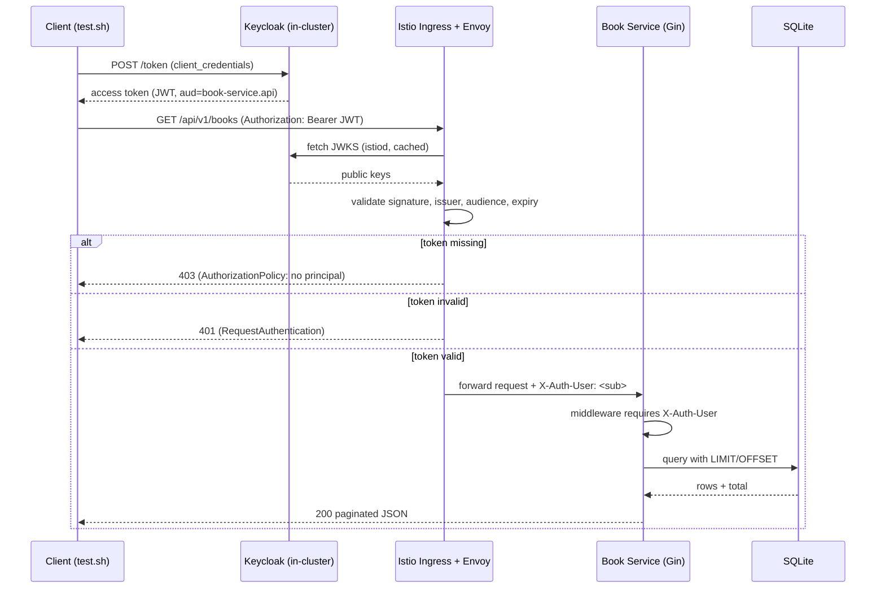
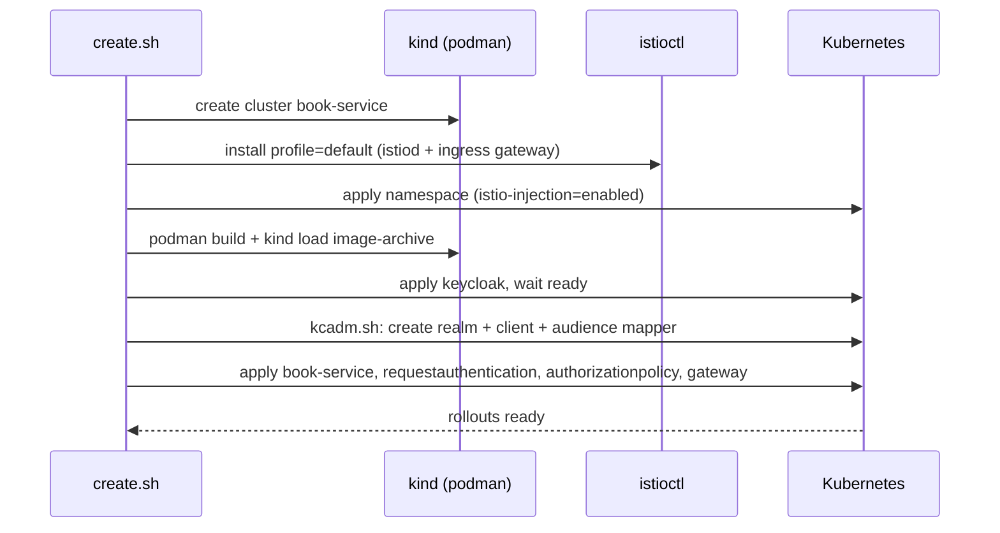

# Book Service — Go + Gin + SQLite, JWT via Istio & Keycloak

A modular REST book service written in Go with Gin and SQLite, running inside a
local **kind** cluster behind **Istio**. Authentication is enforced by the mesh:
**Istio validates the JWT** (signature, issuer, audience, expiry) against an
in-cluster **Keycloak** (the open-source OIDC identity provider) and forwards the
caller identity to the service as a header. The Go app does no JWT crypto itself —
it trusts the mesh, which is the idiomatic Istio pattern.

Keycloak stands in for Auth0: Auth0 is a closed-source SaaS that cannot run inside
the cluster, so this POC uses Keycloak, which speaks the same OIDC/JWT protocol.
Pointing the same manifests at a real Auth0 tenant is a config change, not a code
change (see [Using Auth0 instead](#using-auth0-instead)).

## Architecture


The mesh is the security boundary. `RequestAuthentication` pins the Keycloak issuer
and JWKS URI; `AuthorizationPolicy` requires a valid principal on `/api/*` and
leaves `/` and `/health` open. Istio maps the JWT `sub` claim into the
`X-Auth-User` header. The Go service requires that header and rejects requests
without it.

## Layout

```
cmd/server            entrypoint, wiring
internal/config       env-driven configuration
internal/db           sqlite connection + migration
internal/models       Book and Page (pagination envelope)
internal/repository   data access (CRUD + count)
internal/handler      gin HTTP handlers
internal/middleware   identity gate (reads mesh-forwarded header)
internal/router       route table
deploy                istio + keycloak + kubernetes manifests
create.sh             build kind cluster: istio + keycloak (provisioned) + service
destroy.sh            tear the cluster down
test.sh               get a real Keycloak token, call the service via Istio
```

## Endpoints

| Method | Path                | Auth | Description                    |
|--------|---------------------|------|--------------------------------|
| GET    | `/`                 | no   | list endpoints                 |
| GET    | `/health`           | no   | liveness/readiness             |
| POST   | `/api/v1/books`     | yes  | create a book                  |
| GET    | `/api/v1/books`     | yes  | list books, paginated          |
| GET    | `/api/v1/books/:id` | yes  | get one book                   |
| DELETE | `/api/v1/books/:id` | yes  | delete a book                  |

Pagination: `GET /api/v1/books?page=1&page_size=10`. Response envelope:

```json
{ "page": 1, "page_size": 5, "total": 12, "total_pages": 3, "data": [ ... ] }
```

`page_size` is clamped to `1..100` (default 10); `page` defaults to 1.

## Prerequisites

- `podman` (with a running machine) — `kind` uses the podman provider
- `kind`, `kubectl`
- `istioctl` (optional; `create.sh` downloads it if missing)
- `go` (only for the local dev run and the unit tests)

## Run it

```bash
./create.sh     # kind cluster + istio + keycloak + book-service (a few minutes)
./test.sh       # real token from keycloak, real calls through the istio ingress
./destroy.sh    # delete the cluster
```

### What test.sh proves

```
=== 1. fetch a real token from Keycloak (client_credentials) ===
token acquired (1269 chars)

=== 2. call through Istio WITHOUT a token (expect 403, rejected by the mesh) ===
http status: 403

=== 3. call through Istio with an INVALID token (expect 401) ===
http status: 401

=== 4. create 12 books with the valid token ===
created 12 books

=== 5. page 1, page_size 5 ===
{"page":1,"page_size":5,"total":12,"total_pages":3,"data":[ ...5 items... ]}

=== 6. page 3, page_size 5 (last page, 2 items) ===
{"page":3,"page_size":5,"total":12,"total_pages":3,"data":[ ...2 items... ]}

=== 7. get book by id ===
{"id":1,"title":"Book 1","author":"Author 1","isbn":"978-1-0000-1","year":2001,...}

=== 8. delete book by id (expect 204) ===
http status: 204
```

Steps 2 and 3 are the security contract: a request with **no token** is denied by
the `AuthorizationPolicy` (403), and a request with a **forged token** fails
`RequestAuthentication` (401). Only a real Keycloak-signed token whose `aud`
includes `book-service.api` reaches the app.

## Request path (how JWT validation flows)



## Cluster build (what create.sh does)



## Keycloak setup

After Keycloak boots, `create.sh` provisions it with the admin CLI (`kcadm.sh`,
run inside the pod), which is version-robust:

- realm `books`
- confidential client `book-client` (secret `book-secret`) with **service accounts**
  enabled, so `test.sh` can use the `client_credentials` grant
- an **audience protocol mapper** that stamps `book-service.api` into the access
  token's `aud`, which is what `RequestAuthentication` checks

The realm is provisioned **before** `RequestAuthentication` is applied, so the
book-service sidecar's first JWKS fetch always finds the keys.

`test.sh` reaches Keycloak on `localhost:8081` via `kubectl port-forward`, so the
token issuer is `http://localhost:8081/realms/books` — which is exactly the issuer
pinned in `deploy/requestauthentication.yaml`. Istiod fetches the JWKS in-cluster
at `http://keycloak.book-service.svc.cluster.local:8080/...`.

## Using Auth0 instead

To swap Keycloak for a real Auth0 tenant, edit `deploy/requestauthentication.yaml`:

```yaml
issuer: "https://YOUR_TENANT.us.auth0.com/"
jwksUri: "https://YOUR_TENANT.us.auth0.com/.well-known/jwks.json"
audiences:
  - "https://book-service.api"
```

Create an Auth0 API with that identifier and a machine-to-machine application, then
have the client fetch a token with the `client_credentials` grant. No application
code changes — the mesh contract (`X-Auth-User` from the `sub` claim) is identical.

## Local dev run (no cluster)

For fast iteration without the mesh, `start.sh` runs the service directly against a
local SQLite file. There is no Istio here, so the auth middleware simply requires
the `X-Auth-User` header to be present (the header Istio would populate).

```bash
./start.sh
curl -H "X-Auth-User: dev" http://localhost:8080/api/v1/books
./stop.sh
```

## Configuration

| Env var       | Default       | Meaning                                    |
|---------------|---------------|--------------------------------------------|
| `PORT`        | `8080`        | HTTP listen port                           |
| `DB_PATH`     | `books.db`    | SQLite file path                           |
| `AUTH_HEADER` | `X-Auth-User` | header Istio populates from the JWT `sub`  |

## Tests

```bash
go test ./...
```

```
ok  	book-service/internal/repository
ok  	book-service/internal/router
```

The repository tests verify pagination offset boundaries and count; the router
tests verify that a missing mesh identity is rejected (the security contract) and
that pagination metadata is correct across pages.
