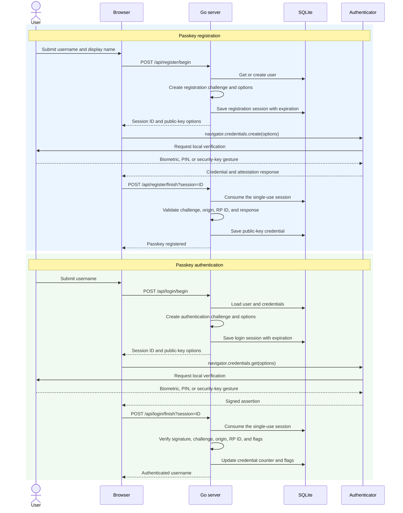

# WebAuthn Passkeys Go

A small Go service with SQLite and a browser interface for registering and authenticating with passkeys. Passwords never enter the system. The browser creates a scoped public-key credential and the server stores only the credential record required for later signature verification.

The implementation follows the [WebAuthn Level 3 specification](https://www.w3.org/TR/webauthn-3/) and uses the Go WebAuthn library for ceremony validation.

## How WebAuthn works

WebAuthn replaces a shared password with a public-key credential scoped to a relying party and its domain. The authenticator can be built into the device, provided by a password manager, or supplied by a security key.

During registration:

1. The server creates a random challenge and sends credential-creation options to the browser.
2. The browser checks the relying-party identity and asks the authenticator to create a credential.
3. The user confirms the operation with a biometric, device PIN, or security-key gesture.
4. The authenticator creates a key pair. Its credential provider protects the private key, while the public key and credential metadata are returned to the server.
5. The server validates the challenge, origin, relying-party ID, and user-verification flags before storing the credential.

During authentication:

1. The server creates a new random challenge and sends assertion options to the browser.
2. The browser asks the authenticator for a credential valid for the relying-party ID.
3. After local user verification, the authenticator signs data containing the challenge and relying-party binding.
4. The server verifies the signature with the stored public key and checks the challenge, origin, relying-party ID, and authenticator flags.
5. A valid assertion proves control of the private key without sending the private key or a password to the server.

Each challenge is fresh and short-lived, which prevents a captured response from being reused. Credentials are bound to the relying-party domain, which prevents a credential from being used on a look-alike phishing domain. Synced passkey providers may transfer encrypted credential material between a user's devices, but the server still receives only the public credential data needed for verification.

## Application flow



The browser converts WebAuthn's binary fields to and from Base64URL for the JSON API. The server stores users, public-key credentials, and ceremony sessions in SQLite. Registration creates a discoverable credential, but this interface still asks for a username before authentication so the server can load that user's allowed credentials.

## Pros and cons

### Pros

- Phishing resistant because credentials are bound to the legitimate relying-party domain.
- No password or reusable shared secret is stored or transmitted by the server.
- Database exposure does not directly reveal a secret that can authenticate as the user.
- Biometric data stays on the user's device; the server receives only proof of local verification.
- Fresh challenges and single-use sessions prevent replay of captured authentication responses.
- Passkeys can provide a fast sign-in experience through platform authenticators and supported cross-device flows.
- WebAuthn is a browser standard supported across major operating systems and browsers.

### Cons

- Account recovery must be designed for lost devices, unavailable credential providers, and users without another enrolled authenticator.
- Browser, operating-system, enterprise-policy, and authenticator differences can make support and troubleshooting more complex.
- Relying-party ID and origin configuration must be exact; domain changes and multi-domain deployments require careful planning.
- The server must correctly manage challenges, expiration, credential state, enrollment authorization, and application sessions.
- Synced passkeys can create ecosystem dependencies, while device-bound credentials require backup enrollment or recovery paths.
- WebAuthn secures authentication but does not replace authorization, secure session cookies, CSRF protection, rate limiting, or broader application security.

## Security properties

- Challenges are generated by the WebAuthn library and stored server-side in SQLite.
- Ceremony sessions are single-use and expire automatically.
- The allowed origin is pinned to `http://localhost:8090` by default.
- The relying-party ID is pinned to `localhost` by default.
- Registration creates a discoverable credential.
- Registration and authentication require local user verification.
- Existing accounts cannot enroll another passkey without a separate authenticated enrollment flow.
- Credential counters and flags are persisted after successful authentication.
- Cross-origin framing is blocked by HTTP security headers.

## Structure

```text
main.go           HTTP service and WebAuthn ceremonies
store.go          SQLite users, credentials, and sessions
security_test.go  protocol rejection checks
web/              browser interface
start.sh          builds and starts the service
stop.sh           stops the service
test.sh           runs tests and checks the live service
```

## Run

```bash
./start.sh
```

Open `http://localhost:8090`, register a passkey, then authenticate with it. A platform authenticator such as Touch ID, Windows Hello, Android screen lock, or a compatible security key is required.

`localhost` is treated as a secure WebAuthn context by modern browsers. A non-local deployment must use HTTPS and set matching values:

```bash
WEBAUTHN_ORIGIN=https://passkeys.acme.test WEBAUTHN_RP_ID=passkeys.acme.test ./start.sh
```

## Stop

```bash
./stop.sh
```

## Test

```bash
./test.sh
```

The test suite proves rejection of:

- a replayed ceremony session
- an incorrect browser origin
- a wrong relying-party ID hash
- an authenticator response without user verification

It also starts the service, checks its health endpoint, begins a registration ceremony, and verifies that the returned browser options require user verification.
